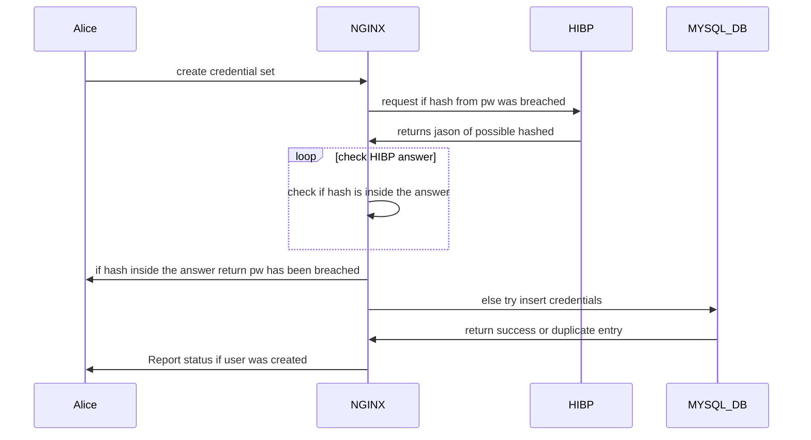
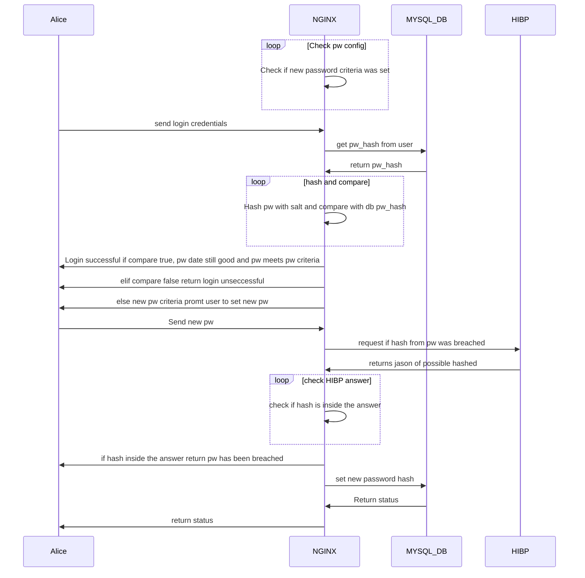
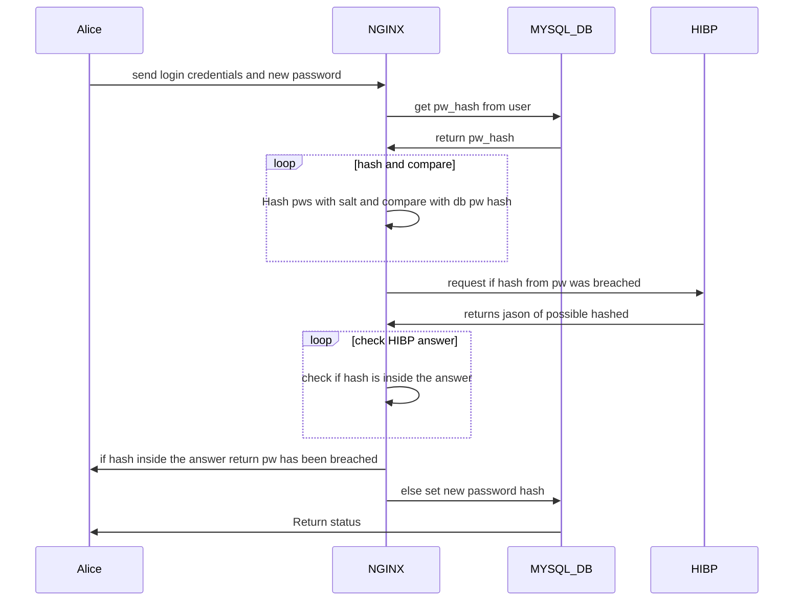
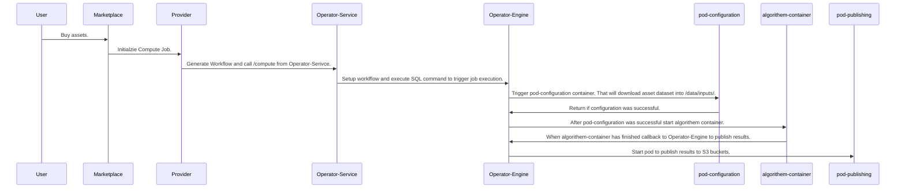

PMS by Alexander Eger

## Labor Software Security
## Password Management System by
## Alexander Eger ENITS 1 email: aeger1@stud.hs-offenburg.de

## Frameworks and setup
-Frameworks in use:
Docker
  - NGING
  - MYSQL
  - Python Flask

GITLAB CI to automaticaly test new function

Possible API Calls:

1. http://"IP"/create 
- create a new set of username and password hash for a user.
How its implemented:

2. http://"IP"/login
- login a existing user with username and password
Implementation:

3. http://"IP"/changePassword
- change users password need to send old password aswell to check if he is allowed to change his password
Implementation:

Haveibeenpwned is included as saftey check for password. The API calls /create and /changePassword are checking the hash if it already was included in a breach. If so user needs to create a secure password.

